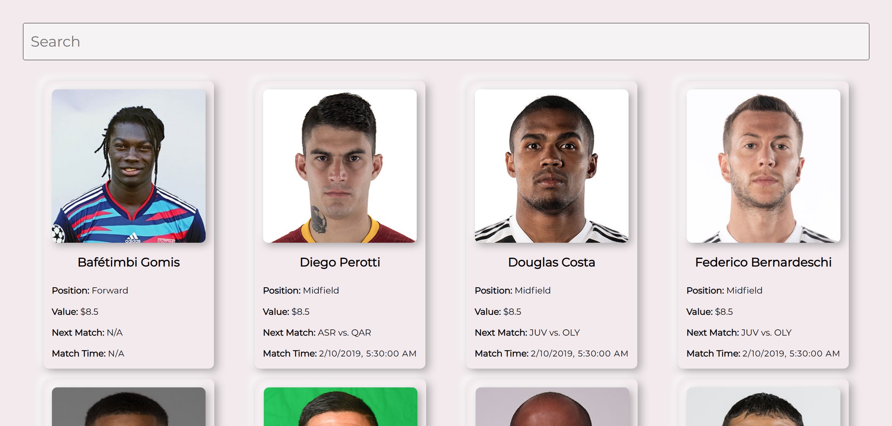

# Coupon Validator

A web app to fetch and display player details.

# Table of Contents

- [Technologies Used](#tused)
- [Getting Started](#started)
- [Pre-requisites](#require)
- [Installation](#installation)
- [Screenshot](#screenshot)
- [Hosted web application](#hosted-app)

## Technologies Used<a name="tused"></a>

- React

## Getting Started<a name="started"></a>

To install and run this app locally simply follow the instructions below:

#### Pre-requisites<a name="require"></a>

You need to have or install the following:

1. Git bash
2. Npm

#### Installation<a name="installation"></a>

- Clone repo
  ```
  git clone https://github.com/Shreykr/Player-Details.git
  ```
- Navigate to project folder
- Run installation
  ```
  npm install
  ```
- Create a `.env` file with this template at the root of your project

  ```
  REACT_APP_API_URL =  https://api.npoint.io
  ```

- Start app
  ```
  npm run start
  ```
- You can now fetch player details and search for players using their name or team name.

#### Screenshot



#### Hosted web application<a name="hosted-app"></a>

## Author

Shreyas K R
